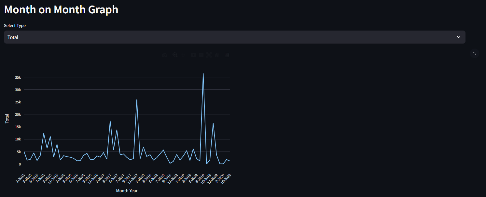
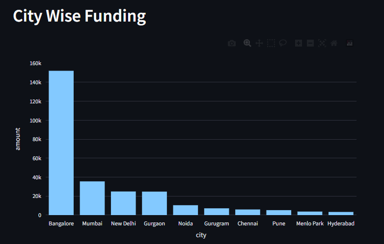
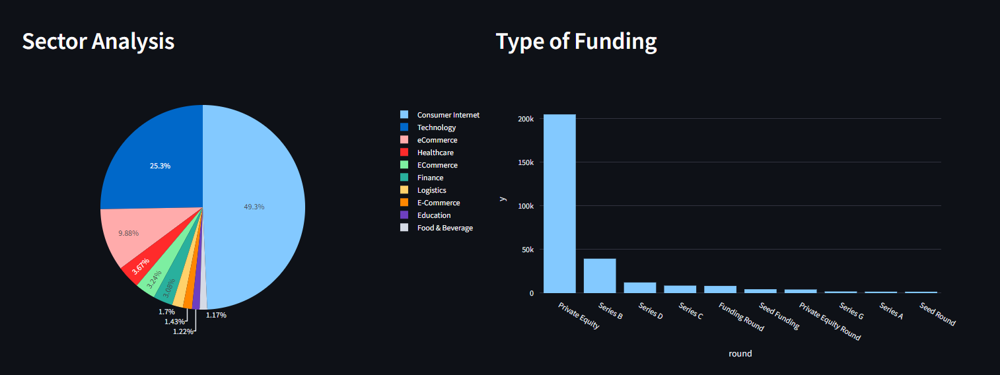
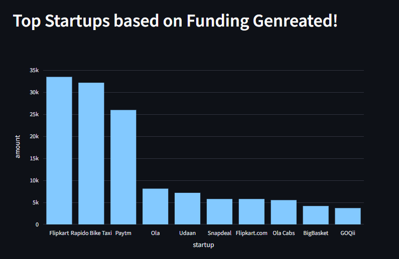
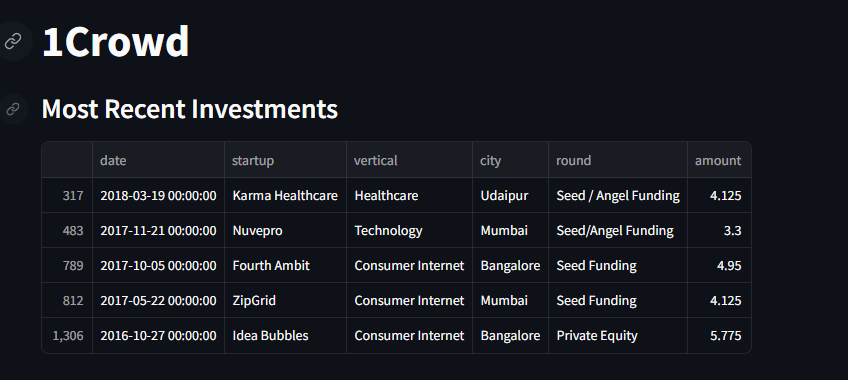
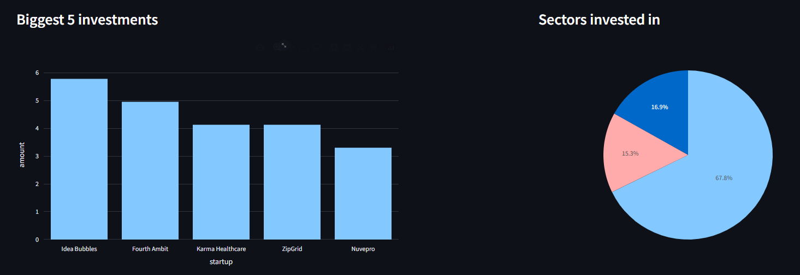
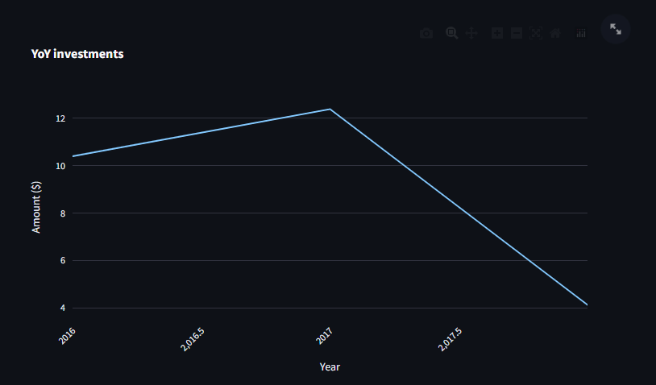

# Overall Analysis on the Indian Startup Funding
So from the dropdown you can select between overall analysis or Investor analysis
and then it will show you the overall analysis on the Indian Startups which include.

Month on Month Graphs.

City wise funding

Sector analysis and type of funding

Top startups based on funding 

Top startup of the year (2015-2020)

# Investor Analysis 
Here can you select a particular investor from the dropdown and 
get to know abou the investment patern of that investor the 
amount he is investing where he investing and many more eg.

Here we performed Analysis on 1Crowd 

Most recent investments

Biggest 5 investments by 1Crowd the Sector they invest in

And Year on Year investments 

